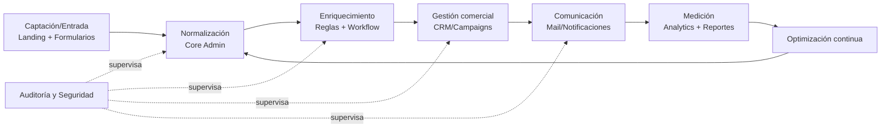
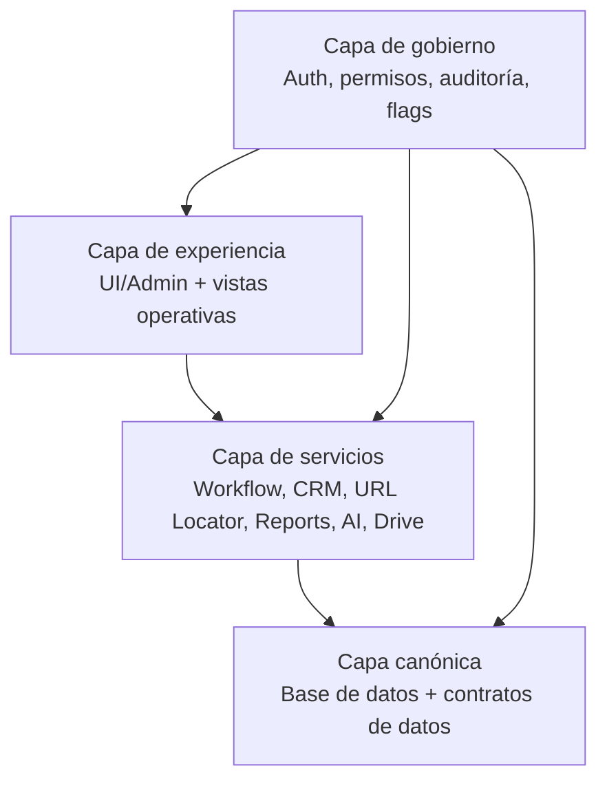
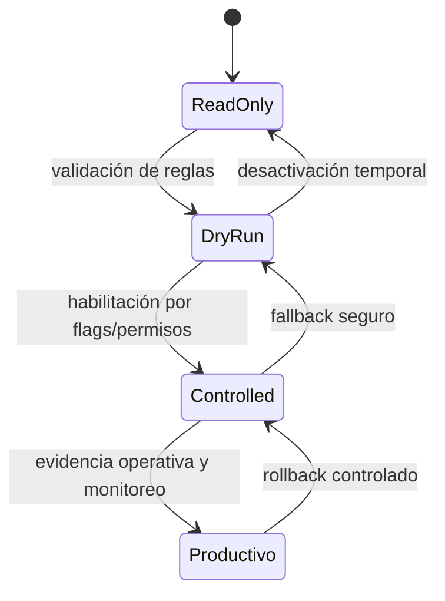
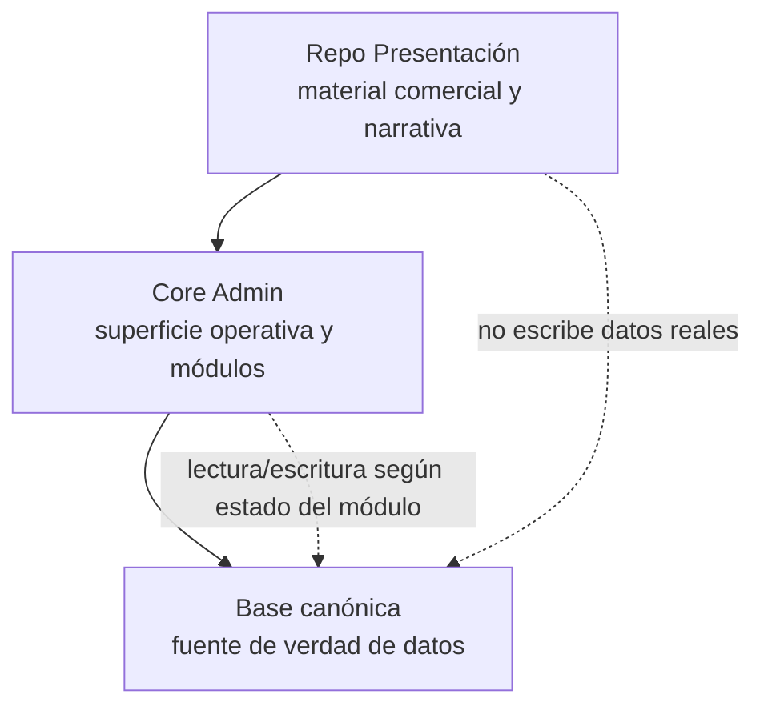

# Diagramas base para presentación

Este documento reúne material visual mínimo para explicar el producto de forma comercial y técnica **sin publicar datos reales**, sin capturas de producción y sin generar PDF por ahora.

## 1) Flujo operativo ideal

## 2) Capas del ecosistema

## 3) Estados de módulo

## 4) Relación Presentación, Core Admin y Base canónica

## Reglas de uso de estos diagramas

- Mantener contenido genérico y anonimizado.
- No incluir capturas de producción.
- No incluir PII, secretos, URLs privadas ni credenciales.
- No usar logos de terceros sin autorización explícita.
- Este material es base para futuras exportaciones (PDF/GitHub Pages), no entrega final.
